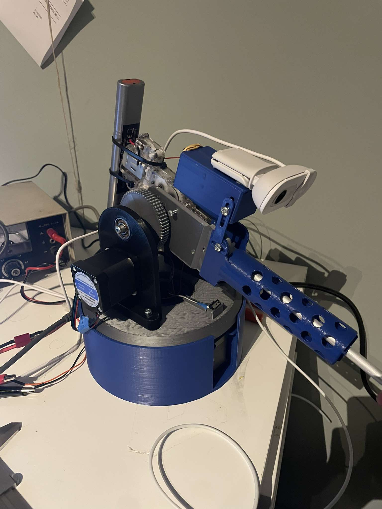

# Camera Tracking/Manual Sentry

## **Project Overview**
This project is a camera tracking turret that can follow a target and trigger an action (e.g., shoot) when the target is centered. The system is powered by a Raspberry Pi and an Arduino, with 3D-printed components for the turret structure. The Raspberry Pi runs a tracking algorithm using OpenCV, while the Arduino controls the turret’s movement and firing mechanism. There are 2 .py scripts the manual one is the latest verion this one features threading and manual controll And its overall better optimized.
 
---


https://github.com/user-attachments/assets/e50b6156-1771-4bf7-af76-c94f0d1e761e


## **Features**
- **Real-Time Target Tracking:**
  - Uses OpenCV on a Raspberry Pi to detect and track targets.
  - Sends position corrections to the Arduino via UART.
- **Precision Movement:**
  - Stepper motors ensure smooth and accurate turret movement.
  - Adjustable proportional control for tracking precision.
  - Homing Switch
- **Customizable Shooting Mechanism:**
  - The Arduino triggers a shooting mechanism when the target is centered.
- **3D-Printed Design:**
  - Designed in Fusion 360 and assembled with 3D-printed parts.
- **Remote Control**
   - using Z Q S D to aim manualy on a target.
   - The sentry can be switched from manual mode to tracking mode with ENTER and vise versa.
---

## **Hardware Components**
1. **Turret Structure:**
   - Fully designed in Fusion 360.
   - 3D-printed and manually assembled.
2. **Stepper Motors:**
   - Controls the turret’s pan and tilt movement.
3. **Stepper Drivers:**
   - Connects the stepper motors to the Arduino for precise control.
5. **Relay**
   - The gearbox trigger of the bb-gun is briged using a Relay which is controlled by the Arduino.
4. **Arduino:**
   - Processes UART commands from the Raspberry Pi.
   - Controls the stepper motors and triggers the shooting mechanism.
5. **Raspberry Pi:**
   - Runs the OpenCV-based tracking algorithm.
   - Sends position data and commands to the Arduino.
6. **Camera:**
   - Captures video for real-time tracking.
7. **Shooting Mechanism:**
   - Controlled by the Arduino (e.g., solenoid, servo).
8. **Limit/Homing Switch:**
   - If the Switch is triggerd the Sentry will go to the designated homing position.
---

## **Software Overview**
### **Raspberry Pi**
- **Language:** Python
- **Libraries:**
  - OpenCV for image processing and target tracking.
  - PySerial for UART communication with the Arduino.
- **Key Functionality:**
  - Captures video frames from the camera.
  - Detects and tracks targets using Haar Cascade.
  - Calculates position errors relative to the center of the frame.
  - Sends error data or "shoot" command to the Arduino over UART.

### **Arduino**
- **Language:** C++
- **Libraries:**
  - AccelStepper for stepper motor control.
- **Key Functionality:**
  - Processes position errors received from the Raspberry Pi.
  - Moves steppers to minimize tracking error.
  - Activates the shooting mechanism when the "shoot" command is received.

---

## **Setup Instructions**

### **1. Hardware Assembly**
1. 3D-print the turret components and assemble the structure.
2. Mount the stepper motors and connect them to the stepper drivers.
3. Connect the stepper drivers to the Arduino.
4. Connect the camera to the Raspberry Pi.
5. Power the system (e.g., external power for motors, USB power for Raspberry Pi and Arduino).

### **2. Software Setup**
#### Raspberry Pi:
1. Install required libraries:
   ```bash
   sudo apt update
   sudo apt install python3-opencv python3-serial
   ```
2. Copy the tracking script to the Raspberry Pi.
3. Run the script:
   ```bash
   python3 manualSentryMode.py (or the SentryMode.py PS for absolute noobs do not paste whats in these brackets)
   ```

#### Arduino:
1. Upload the Arduino code using the Arduino IDE.
2. Ensure the UART baud rate matches the Raspberry Pi script (115200).

---

## **Usage**
1. Power on the system.
2. Start the Raspberry Pi tracking script.
3. Place a target within the camera’s field of view.
4. Observe the turret as it tracks the target.
5. When the target is centered, the turret will trigger the shooting mechanism.

---

## **Troubleshooting**
- **Camera Lag:**
  - Reduce the frame resolution and frame rate in the Raspberry Pi script.
- **Stepper Motors Not Responding:**
  - Check the wiring between the Arduino, stepper drivers, and motors.
  - Ensure the correct pins are configured in the Arduino code.
- **Inaccurate Tracking:**
  - Adjust the proportional control parameter (`kp`) in the Arduino code.
- **No Shooting Trigger:**
  - Verify that the Raspberry Pi sends the "shoot" command when the target is centered.

---

## **Future Enhancements**
- Add a web interface to monitor and control the turret remotely.
- Implement more advanced tracking algorithms (e.g., YOLO or Deep Learning models).
- Integrate additional sensors for enhanced precision and safety.


## License

This project is open-source and available under the MIT License.
